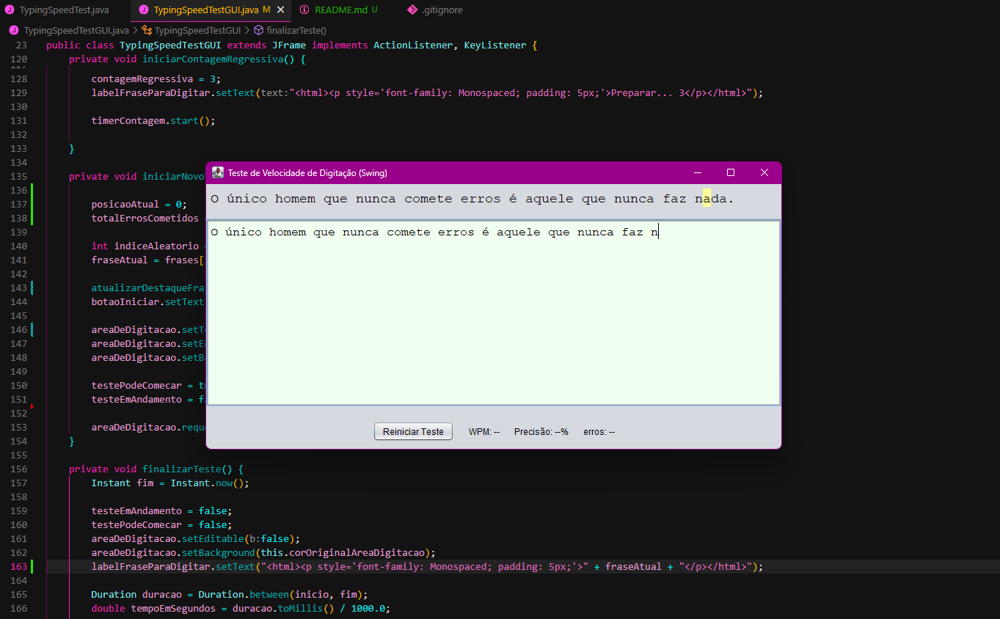

# ☕ Java Typing Speed Test (Console & Swing GUI)

Este é um projeto de um Teste de Velocidade de Digitação (WPM - Palavras por Minuto) completo, desenvolvido em Java. Ele foi criado como um projeto de aprendizado para cobrir desde a lógica de console básica até uma aplicação gráfica robusta com Swing (V2.0).

Este repositório contém duas versões do aplicativo:
1.  `TypingSpeedTest.java`: A versão original, 100% baseada no console.
2.  `TypingSpeedTestGUI.java`: A versão gráfica final (V2.0+) com interface Swing.

## 📸 Screenshot (Versão GUI V2.3)



## ✨ Funcionalidades (Features)

Este projeto foi construído em etapas, adicionando complexidade gradualmente.

### Console (`TypingSpeedTest.java`)
* Cálculo de WPM e precisão (baseado no texto final).
* Escolha aleatória de frases.
* Loop de "Jogar Novamente".

### GUI - Versão 1.0 (Lógica Antiga)
* Interface gráfica completa construída com `javax.swing`.
* Cálculo de WPM e precisão baseado no texto final (ao pressionar "Enter").

### GUI - Versão 2.0+ (Lógica Robusta em Tempo Real)
* **Contagem de Erros em Tempo Real:** O aplicativo agora valida *cada tecla* digitada.
* **Feedback Imediato:** Tocar na tecla errada emite um "beep" (`Toolkit.beep()`) e impede que o caractere errado apareça. A tecla "Backspace" também é desabilitada.
* **Contagem Regressiva:** Um `javax.swing.Timer` controla uma contagem "3... 2... 1... VAI!" antes de cada teste, dando tempo para o usuário se preparar.
* **Destaque da Letra Ativa:** A próxima letra a ser digitada é destacada com um fundo amarelo, movendo-se em tempo real com a digitação do usuário (criado com HTML dinâmico em um `JLabel`).
* **Feedback Visual:** O aplicativo usa um "Look and Feel" Nimbus moderno (`UIManager`) e muda a cor de fundo da área de texto para verde (`java.awt.Color`) durante o teste.

## 🛠️ Tecnologias Utilizadas
* **Linguagem:** Java
* **Bibliotecas Gráficas:** Java Swing (`JFrame`, `JPanel`, `JLabel`, `JTextArea`, `JButton`)
* **Eventos:** `ActionListener` (para botões e Timer) e `KeyListener` (para digitação em tempo real)
* **Controle de Tempo:** `java.time.Instant`, `java.time.Duration` e `javax.swingimg.Timer`
* **Versionamento:** Git e GitHub

## 🚀 Como Executar Localmente

Você pode compilar e executar as duas versões do projeto.

**Requisitos:**
* Java JDK (versão 8 ou superior)

**1. Clone o repositório:**
```bash
git clone [https://github.com/KarineSilvaCodes/java-typing-speed-test.git](https://github.com/KarineSilvaCodes/java-typing-speed-test.git)
cd java-typing-speed-test
```
**2. Para rodar a versão GUI (Recomendada):**
```bash
# Compile o arquivo .java
javac TypingSpeedTestGUI.java

# Execute o arquivo .class
java TypingSpeedTestGUI
```

**3. Para rodar a versão Console:**
```bash
# Compile o arquivo .java
javac TypingSpeedTest.java

# Execute o arquivo .class
java TypingSpeedTest
```

## 📜 Licença

Este projeto é distribuído sob a licença MIT. Veja o arquivo `LICENSE` para mais detalhes.